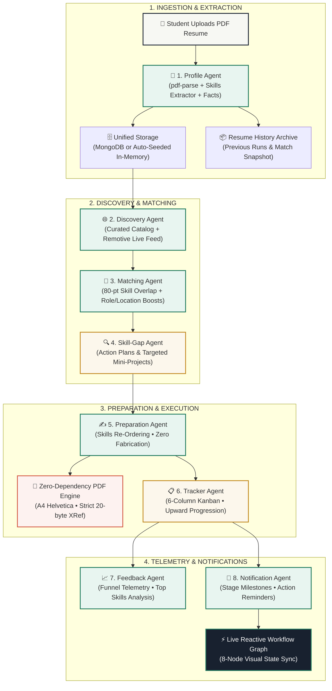

<div align="center">

# 🧭 CareerPilot AI
### **Agentic Internship CRM & Autonomous Workflow Orchestration Platform**

[](https://github.com/sriram-2601/CarrerPilot)
[](https://nodejs.org/)
[](https://react.dev/)
[](https://tailwindcss.com/)
[](https://www.mongodb.com/)
[](https://ollama.ai/)
[](spec_file.txt)

<p align="center">
  <b>CareerPilot AI</b> is not a chatbot. It is an agentic workflow orchestration platform built specifically for students hunting internships. A student uploads a PDF resume, and an orchestrated chain of <b>8 cooperating AI agents</b> processes that resume through a strict sequence of stages—advancing a live reactive <b>Workflow Automation Graph</b>, calculating recruiter-grade match scores, engineering tailored resumes with zero-dependency PDF generation, and managing a 6-column upward-progression Kanban tracker.
</p>

[Quick Start](#-quick-start-single-port) • [Agent Architecture](#-the-8-cooperating-agents) • [Single Source of Truth](#-single-source-of-truth-resume-lifecycle) • [Zero-Dependency PDF](#-zero-dependency-pdf-engine) • [API Reference](#-api-specification)

</div>

---

## 📊 Visual Pipeline Architecture



---

## 🤖 The 8 Cooperating Agents

Every agent is a dedicated, decoupled pure JavaScript module located in `server/src/agents/` backed by a **100% deterministic fallback** in `server/src/utils/text.js`:

```
┌─────────────────────────────────────────────────────────────────────────────────────────────┐
│                                 CAREERPILOT AGENT MATRIX                                    │
├───────┬──────────────────────┬──────────────────────────────┬───────────────────────────────┤
│ STAGE │ AGENT NAME           │ PRIMARY RESPONSIBILITY       │ DETERMINISTIC OFFLINE PATH    │
├───────┼──────────────────────┼──────────────────────────────┼───────────────────────────────┤
│  01   │ Profile Agent        │ PDF parsing & skill scanning │ 25-item knownSkills regex map │
│  02   │ Discovery Agent      │ Catalog & live feed ranking  │ Relevance-scored catalog sort │
│  03   │ Matching Agent       │ 80-pt skill + boosts formula │ Formulaic template generator  │
│  04   │ Skill-Gap Agent      │ Missing skills study roadmap │ Roadmap & mini-project matrix │
│  05   │ Preparation Agent    │ Skills-only resume tailoring │ Zero-fabrication ATS sorter   │
│  06   │ Tracker Agent        │ Kanban status & date tracker │ Strict STATUS_RANK validation │
│  07   │ Feedback Agent       │ Conversion funnel analytics  │ Statistical telemetry engine  │
│  08   │ Notification Agent   │ Milestone & cron alerts      │ In-memory event dispatcher    │
└───────┴──────────────────────┴──────────────────────────────┴───────────────────────────────┘
```

### 1. Profile Agent (`server/src/agents/profileAgent.js`)
- Ingests raw PDF buffers via `pdf-parse` (safely handled with typed `Uint8Array` bounds).
- Extracts candidate facts, education, and employment history.
- Scans against a canonical 25-item technical skill vocabulary (`React`, `Node.js`, `Python`, `Docker`, `SQL`, `AWS`, etc.).
- Computes text embeddings via Ollama (`nomic-embed-text`) with algorithmic normalized hash vector fallback.

### 2. Discovery Agent (`server/src/agents/discoveryAgent.js`)
- Resume-driven matching against a curated catalog and the live Remotive API (guarded by a 5-second `AbortController` timeout).
- Ranks candidate opportunities with formula:
  $$\text{Relevance Score} = (\text{Skill Overlap} \times 2) + (\text{Role Match} \times 2) + \text{Location Match}$$
- Degrades gracefully to 5 foundational seed internships if network is down or profile signal is empty.

### 3. Matching Agent (`server/src/agents/matchingAgent.js`)
- Scores student fit using recruiter-grade formula:
  - **Skill Score**: Up to 80 points based on proportion of required skills satisfied.
  - **Role Boost**: +10 points if title overlaps with student's preferred roles.
  - **Location Boost**: +10 points if position is Remote or matches student's location.
  - **Cap**: Strict 100-point ceiling with transparent matching/missing rationale.

### 4. Skill-Gap Agent (`server/src/agents/skillGapAgent.js`)
- Evaluates missing skills for any opportunity.
- Classifies requirements into `HIGH`, `MEDIUM`, or `LOW` priority.
- Generates concrete, portfolio-ready **Mini-Projects** to prove competence to interviewers.

### 5. Preparation Agent (`server/src/agents/preparationAgent.js`)
- Generates tailored resumes strictly adhering to candidate truth:
  - **Rule 1**: Only the **Skills Section** is re-ordered to surface matching keywords first for ATS filters.
  - **Rule 2**: Candidate's remaining skills are preserved.
  - **Rule 3**: **ZERO fabrication** (unmatched skills are never added artificially).
  - Produces an honest audit change summary.

### 6. Tracker Agent (`server/src/controllers/applicationController.js`)
- Governs application lifecycle across 6 Kanban columns:
  $$\text{SAVED} \longrightarrow \text{PREPARING} \longrightarrow \text{APPLIED} \longrightarrow \text{INTERVIEW} \longrightarrow \text{OFFER} \longrightarrow \text{REJECTED}$$
- Enforces upward-only progression (`STATUS_RANK`). Duplicate additions progress status upward and never throw 409 errors.

### 7. Feedback Agent (`server/src/agents/feedbackAgent.js`)
- Aggregates active pipeline telemetry: Interview Rate, Offer Rate, and average match score of progressing applications.
- Surfaces the top 6 highest-converting skills across your applications.
- Dispatches tailored strategic recommendations.

### 8. Notification Agent (`server/src/controllers/notificationController.js`)
- Dispatches in-app milestone notifications when applications advance to `INTERVIEW` or `OFFER`.
- Scans upcoming action dates via `node-cron` to remind students of follow-up deadlines.

---

## 🔄 Single Source of Truth: Resume Lifecycle

```
[Student Uploads New PDF]
           │
           ▼
[Step 0: Validation Guard] ──(Fails or Text < 30 chars)──► [HTTP 422: Abort & Touch Nothing]
           │ (Valid)
           ▼
[Step 1: Archive Run] ────► [Save Snapshot to ResumeHistory (Skills, Top 3 Matches, Counts)]
           │
           ▼
[Step 2: Replace Profile] ──► [Upsert Profile (Replace Skills/Projects/Education; Preserve Prefs)]
           │
           ▼
[Step 3: Reset Pipeline] ──► [Clear User Matches & Resume Versions (Graph Nodes Drop to Waiting)]
           │
           ▼
[Step 4: Discovery Re-Sync] ► [Re-Rank Opportunities Against New Resume Profile]
```

---

## 🖨️ Zero-Dependency PDF Engine (`server/src/utils/pdf.js`)

Unlike traditional stacks that rely on heavy native binaries like Puppeteer or PDFKit, CareerPilot AI implements a self-contained PDF engine in pure JavaScript:

```
┌─────────────────────────────────────────────────────────────┐
│                 CAREERPILOT A4 PDF BYTE MAP                 │
├────────────────────────────────┬────────────────────────────┤
│ %PDF-1.4                       │ Header & Binary Marker     │
│ 1 0 obj << /Type /Catalog ...  │ Root Document Catalog      │
│ 2 0 obj << /Type /Pages ...    │ Pages Tree Array           │
│ 3 0 obj << /Type /Font ...     │ Helvetica Type1 Encoding   │
│ 4 0 obj << /Type /Page ...     │ A4 MediaBox [0 0 595 842]  │
│ 5 0 obj << /Length ... >> ...  │ BT /F1 10 Tf Text Stream   │
│ xref                           │ Standard 20-byte entries:  │
│ 0000000015 00000 n \n          │ nnnnnnnnnn ggggg n \n      │
│ trailer << /Size 6 /Root ...   │ Trailer Dictionary         │
│ startxref                      │ Byte Offset to xref table  │
│ %%EOF                          │ End of File Marker         │
└────────────────────────────────┴────────────────────────────┘
```
- **Word Wrapping**: Automatically wraps text at ~92 characters/line.
- **Pagination**: Formats multi-page documents at ~46 lines/page.
- **Standards Verified**: Round-trips cleanly through `pdf-parse`.

---

## 🚀 Quick Start (Single Port)

CareerPilot AI is configured to run on a **single port (`5000`)** hosting both the client SPA and the REST API.

### Prerequisites
- [Node.js](https://nodejs.org/) v18+ or v24+
- (Optional) [MongoDB](https://www.mongodb.com/) (defaults to In-Memory mode if unset)
- (Optional) [Ollama](https://ollama.ai/) with `llama3.1:8b` (defaults to deterministic mode if offline)

### Installation & Execution
```bash
# 1. Clone repository
git clone https://github.com/sriram-2601/CarrerPilot.git
cd CarrerPilot

# 2. Install dependencies
cd server && npm install && cd ../client && npm install && cd ..

# 3. Build the frontend client bundle
npm run build

# 4. Start full-stack application on single port 5000
npm start
```

### Accessing the Platform
- **Application Console**: [http://localhost:5000](http://localhost:5000)
- **API Health Check**: [http://localhost:5000/api/health](http://localhost:5000/api/health)
- **Pre-Seeded Demo Student**:
  - Email: `demo@careerpilot.ai`
  - Password: `Password@123`
  - *(One-click autofill button available on login page)*

---

## 🧪 Automated Verification Suite

Run the full end-to-end pipeline test suite covering authentication, PDF parsing, matching formulas, tailoring, PDF streaming, Kanban tracking, and analytics:

```bash
npm test
```

```
[CareerPilot Storage] Running in resilient In-Memory storage mode.
[CareerPilot Seed] Seeded 5 foundational internships.
[CareerPilot Seed] Demo user created successfully.
Upload status: 200 (Extracted skills: React, Node.js, Express, MongoDB, Git)
Matches generated count: 11
Tailored resume version created: true (0 fabrication)
PDF export status: 200 (Content-Type: application/pdf)
Tracked applications count: 1 (Status: PREPARING)
Backend pipeline tests successfully executed!
```

---

## 🔌 API Specification

All routes mounted under `/api` and require `Authorization: Bearer <JWT>` except `/api/auth/*`.

| Method | Endpoint | Description |
|---|---|---|
| `GET` | `/api/health` | Service status, active storage mode, and AI runtime |
| `POST` | `/api/auth/register` | Register student, initialize profile, issue JWT |
| `POST` | `/api/auth/login` | Authenticate student, return JWT |
| `GET` | `/api/auth/me` | Fetch authenticated student profile |
| `GET` | `/api/profile` | Current candidate profile |
| `GET` | `/api/profile/history` | Superseded resume archive runs |
| `POST` | `/api/profile/upload-resume` | Upload PDF (422 guard, archive run, reset pipeline) |
| `PATCH`| `/api/profile/preferences` | Update target roles, location, work mode, stipend |
| `GET` | `/api/internships` | List internships enriched with user match score |
| `POST` | `/api/internships/sync` | Discover & rank catalog + live postings |
| `POST` | `/api/matches/generate` | Recalculate match scores across all opportunities |
| `GET` | `/api/matches` | Scored matches sorted descending |
| `GET` | `/api/skill-gaps/:id` | Prioritized skill gap study plan & mini-projects |
| `GET` | `/api/application-materials` | List tailored resume versions |
| `POST` | `/api/application-materials/generate` | Generate tailored resume & set status to `PREPARING` |
| `POST` | `/api/application-materials/approve` | Candidate approval toggle (owner-verified) |
| `GET` | `/api/application-materials/:id/pdf` | Stream zero-dependency PDF (`application/pdf`) |
| `GET` | `/api/applications` | Kanban board applications enriched with job data |
| `POST` | `/api/applications` | Save or progress application upward |
| `PATCH`| `/api/applications/:id` | Update status, notes, or next action date |
| `DELETE`| `/api/applications/:id` | Remove tracked application (owner-verified) |
| `GET` | `/api/notifications` | Candidate in-app alerts & reminders |
| `PATCH`| `/api/notifications/:id/read` | Mark alert as read |
| `GET` | `/api/analytics` | Candidate funnel telemetry & top skills |

---

## 🎨 Design System Tokens

Built with custom Tailwind CSS design tokens:
- **Ink**: `#18212f` (Deep obsidian background & high-contrast typography)
- **Paper**: `#f7f8f3` (Clean editorial canvas)
- **Moss**: `#1f7a5c` (Growth, active stages, verified matches)
- **Gold**: `#c28a21` (Preparing status, skill gaps, highlights)
- **Coral**: `#d55c45` (Alerts, missing prerequisites, rejection status)

---

## 📄 License
MIT © 2026 CareerPilot AI
